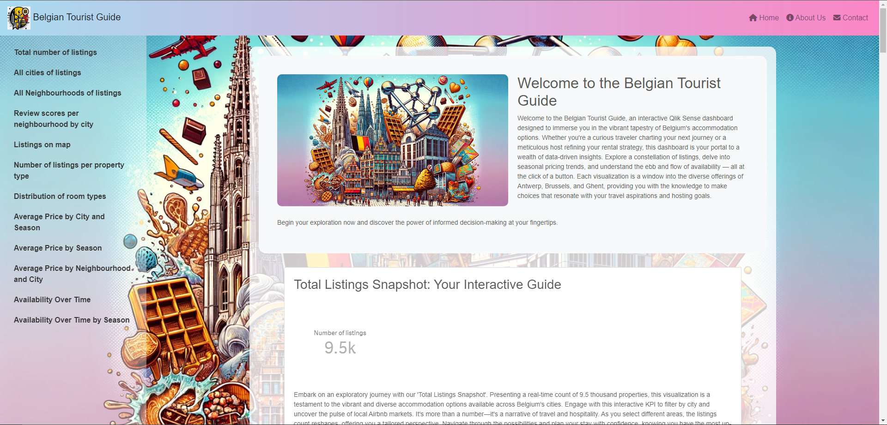
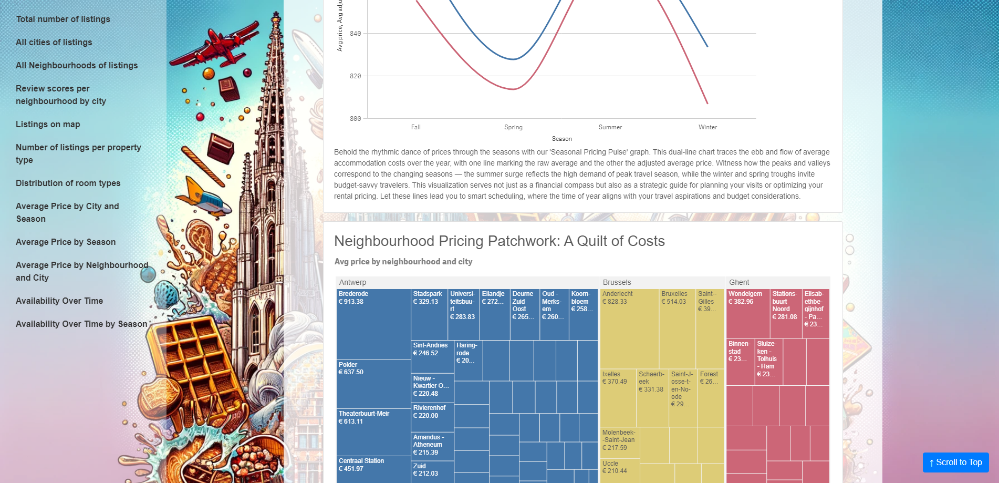

# Insightful Journeys: A BI Solution for Airbnb Travelers in Belgium

## Introduction

Welcome to *`Insightful Journeys`*, a comprehensive Business Intelligence solution designed to enhance the travel experience for tourists visiting Antwerp, Brussels, and Ghent. Utilizing detailed Airbnb data, our solution offers valuable insights into accommodations, helping travelers make informed lodging decisions.

## Target Audience

This project is aimed at tourists planning their visits to Antwerp, Brussels, or Ghent. Whether you're seeking the best value, the most popular neighborhoods, or accommodations with specific amenities, our dashboard provides the data-driven insights you need.

## Project Scope and Objectives

**Scope:**

- Visualize the average price for Airbnb accommodations across different seasons.
- Identify the most popular neighborhoods and how preferences shift seasonally.
- Explore the variety of available accommodation types.
- Analyze rental prices by accommodation type and neighborhood.
- Highlight top-rated and responsive hosts.
- Track the pattern of reviews over time and by season.
- Assess average review scores for cleanliness, check-in experience, and more.
- Investigate the relationship between minimum nights and guest satisfaction.
- Discover budget-friendly options and their seasonal affordability.

**Objectives:**

Our solution aims to empower tourists with actionable insights, ensuring a smooth and enjoyable travel experience by leveraging data visualization best practices.

## Dashboard and Data Journalism

### Dashboard Story

We delve into the trends, preferences, and factors influencing accommodation choices in Belgium's most visited cities, providing a dynamic and interactive dashboard for exploratory analysis.

### Data Journalism Story

Transforming our dashboard insights into compelling narratives, we guide travelers through informed decision-making processes, highlighting the best times to visit, preferred neighborhoods, and the significance of amenities and host quality.

# Dashboard & App Screenshots

## Dashboard Screenshots (all screenshots can be found on images folder)

### Temporal and Spatial Pricing Analysis

### Seasonal Availability and Pricing Dynamics

### Geographical Insights and Property Overview

Seasonal Availability and Pricing Dynamics

## App Screenshot

## Technical Details

### Data Sources

- Our analysis is based on publicly available Airbnb data from [Inside Airbnb](http://insideairbnb.com/).
- You can download the used datasets [Here](https://drive.google.com/file/d/11VIR1PzJmKQS8c2jUWdPg0bN_YqMKR8p/view?usp=sharing).

### Technologies Used

- **QlikView**: For dashboard development.
- **(SQL) Qlik Scripting**: For the ETL process.
- **HTML, Bootstrap CSS & JavaScript**: For embedding the dashboard into an interactive application.

### Architecture

Data sources (CSV files) are loaded into the QlikView cloud environment and GDrive Storage, then loaded into raw tables. Following data cleaning, the data is loaded into a star schema, and raw tables are dropped at the end of the script execution. The star schema is then used to query visualizations based on filter panes or map filters. After establishing the dashboard, an HTML page with JavaScript was created to connect to the Qlik Cloud API, request the charts, and visualize them in a custom app.

## Installation and Usage

**Run**: python -m http.server

**Go to**: localhost:8000

**login**: *your qlik tenant & password*

This project requires access to my own QlikView tenant for both the dashboard and the embedded app. Detailed setup instructions will be provided upon request.

## Interactive Features

The dashboard includes built-in filters from Qlik, such as filter panes, maps, and tables, allowing users to interactively explore the data based on their preferences.

## Addressing Client Needs

Our BI solution directly addresses the needs of tourists, offering insights into seasonal price trends, popular neighborhoods, accommodation types, and more, to enhance travel planning and experiences.

## Future Enhancements

- Include GeoJson data.
- We are always looking to improve and expand our project. Suggestions for enhancements are welcome.

## Contact Information

For any inquiries or support, please contact Walid Birouk at uki.walid@live.fr or visit my [LinkedIn profile](https://www.linkedin.com/in/walid-birouk/).

Thank you for exploring *`Insightful Journeys`*. We're excited to assist you in discovering the best Airbnb accommodations in Belgium!
